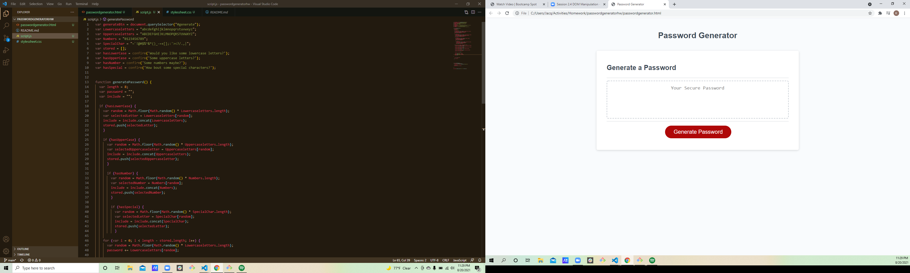

# Password generator Homework

[Link to Password Generator](<a href="C:\Users\Jacq\Activities\Homework\passwordgeneratorhw\passwordgenerator.html">)

## Table of Contents
- [passwordgenerator.html](Contains-the-html-page-for-the-generator.)
- [screenshot](Contains-a-screenshot-of-the-assignment.)
- [script.js](Contains-the-javascript-file.)
- [stylesheet.css](Contains-the-stylesheet.)

## Desciption
A password generator that has a minimum of 8 and a maximum of 128 characters. It also asks what type of characters the user wants to be included in the password.

## Screenshots

## Usage
Use this generator by opening passwordgenerator.html in a browser.

## License
None

## Badges
None